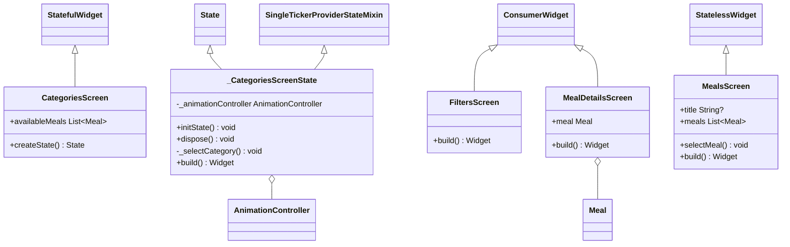

# Meals App Architecture and Documentation

## Introduction
This document provides an overview of the app's architecture, user stories, specifications, and file/folder structure based on the provided code structure. 
The app is designed to help users explore and manage meal categories, view meal details, and apply filters to customize their meal preferences.

## New Features

### Add Meal
The app now allows users to add a new meal with details such as title, image, ingredients, steps, duration, complexity, affordability, and dietary preferences.
Users can save the meal and have it displayed in the list of available meals.

## App Architecture

### User Interface
The app follows a typical Flutter application structure, with screens and widgets:

1. **Screens**: Represent various user interface screens of the app.
    - `CategoriesScreen`: Displays available meal categories.
    - `FiltersScreen`: Allows users to set meal filters.
    - `MealsScreen`: Lists meals based on selected categories.
    - `MealDetailsScreen`: Shows details of a specific meal.
    - `AddNewMeal`: Allows users to add a new meal.
    - `TabsScreen`: Implements the bottom navigation tabs for Categories and Favorites.

2. **Widgets**: Reusable UI components used throughout the app.
    - `CategoryGridItem`: Represents a category grid item.
    - `MainDrawer`: Implements the main navigation drawer.
    - `MealItem`: Displays individual meal items.
    - `MealItemTrait`: A small widget for displaying meal traits (e.g., duration, complexity).

### Data and Models
Data and models are used to manage and represent the app's content:

1. **Data**:
    - `dummy_data.dart`: Contains sample data for meal categories and meals.

2. **Models**:
    - `Category`: Represents a meal category with an ID, title, and color.
    - `Meal`: Represents a meal with details such as ID, title, ingredients, steps, and more.

### State Management
State management is implemented using Riverpod, a Flutter state management package:

1. **Providers**:
    - `FavoriteMealsNotifier`: Manages the user's favorite meals.
    - `FiltersNotifier`: Handles user-selected filters (gluten-free, lactose-free, vegetarian, vegan).
    - `mealsProvider`: Provides the list of available meals.
    - `filteredMealsProvider`: Filters meals based on user-selected filters.

### Main Entry Point
The app's main entry point is defined in `main.dart`. It sets up the app's theme and initializes the `TabsScreen` as the initial view.

## Meals App User Stories

1. **Add Meal**
   - As a user, I want to add a new meal with details such as title, image, ingredients, steps, duration, complexity, affordability, and dietary preferences.
   - I want to save the meal and have it displayed in the list of available meals.

2. **View Meals**
   - As a user, I want to view a list of all available meals.
   - I want to see each meal's title, image, and basic information.

3. **View Meal Details**
   - As a user, I want to view the details of a specific meal when I select it from the list.
   - I want to see information such as ingredients, steps, duration, complexity, affordability, and dietary preferences.
   - I also want to have the option to add or remove the meal from my favorites.

4. **Filter Meals**
   - As a user, I want to filter available meals based on dietary preferences, such as gluten-free, lactose-free, vegetarian, and vegan.
   - I want the filtered meals to update based on my selections.

5. **View Favorites**
   - As a user, I want to view a list of my favorite meals.
   - I want to see each meal's title, image, and basic information.

6. **Visualize Meal Categories**
   - As a user, I want to see a visual representation (e.g., a grid of categories) of available meal categories.
   - I want to select a category and see a list of meals that belong to that category.

7. **Adjust Filters**
   - As a user, I want to adjust my dietary preference filters.
   - I want to customize my filters for gluten-free, lactose-free, vegetarian, and vegan meals.

## Specifications

- **Categories**: The app loads predefined meal categories and displays them in a grid.
- **Meals**: When a category is selected, the app displays a list of meals within that category.
- **Meal Details**: Users can click on a meal to view its details, including ingredients and steps.
- **Filters**: Users can set filters for dietary preferences to customize meal lists.
- **New Meal**: Users can add a new meal with details such as title, image, ingredients, steps, duration, complexity, affordability, and dietary preferences.
- **Favorites**: Users can mark meals as favorites for easy access.
- **Navigation**: Users can navigate between Categories, Add New Meal and Favorites using a bottom navigation bar.
- **Theme**: The app uses a custom theme with a dark color scheme and custom fonts.

## File and Folder Structure
The app's files and folders are organized as follows:

- lib/ (Root Directory)
  - models/ (Folder for Data Models)
    - category.dart (Definition of the `Category` data model)
    - meal.dart (Definition of the `Meal` data model)
  - providers/ (Folder for State Management)
    - favorites_provider.dart (Management of favorite meals)
    - filters_provider.dart (Management of dietary preference filters)
    - meals_provider.dart (Provides a list of meals)
  - screens/ (Folder for App Screens)
    - categories.dart (Categories Screen)
    - filters.dart (Filters Screen)
    - meal_details.dart (Meal Details Screen)
    - meals.dart (Meals Screen)
    - new_meal.dart (Add New Meal Screen)
    - tabs.dart (Tabs Screen, entry point)
  - widgets/ (Folder for Custom Widgets)
    - category_grid_item.dart (Definition of the `CategoryGridItem` widget)
    - main_drawer.dart (Definition of the `MainDrawer` widget)
    - meal_item.dart (Definition of the `MealItem` widget)
    - meal_item_trait.dart (Definition of the `MealItemTrait` widget)
  - main.dart (Entry point of the application)

This organized structure ensures maintainability and modularity, 
making it easier to expand and improve the app's functionality in the future.

## Class Diagrams

Detailed class diagrams are provided below:

Diagram 1: App, Category, Meal, Complexity, Affordability, Filter classes

Diagram 2: CategoriesScreen, _CategoriesScreenState, FiltersScreen, MealsScreen, MealDetailsScreen classes

Diagram 3: The newly added AddNewMeal and _AddNewMealState classes

Diagram 3: The newly added AddNewMeal and _AddNewMealState classes

Diagram 4: TabsScreen, _TabsScreenState, CategoryGridItem, MainDrawer, MealItem, MealItemTrait classes

## Peer Review

## Screenshots

The following screenshots show the app's user interface:

### New Screenshots (after adding new features):

